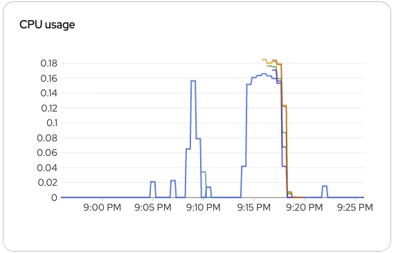

# Stressztest dokumentáció

## Fájlok:
```
.
├── delete.sh   # Egy egyszerű parancs az összes kép törlésére az adatbázisból
├── hpa.yaml    # A backend horizontális skálázója
├── job.yaml    # A kubernetes Job a stressztest futtatására
├── README.md   # Ez a dokumentáció
└── script.js   # A k6 script amit a Job futtat a terheléstesztre
```

## Megvalósítás

Az OKD webes felületén hoztam létre a HPA-t, amelynek a targetje a `photoalbum-backend` Deployment. Mindig legalább egy replica létezik belőle és maximum 5. Skálázás akkor történik, amikor a CPU kihasználtsága eléri az 50%-t. A `behavior` beállításokkal beállítottam, hogy ha kell azonnal induljon az új pod, de ne szűnjön meg olyan gyorsan, így elkerülve, hogy túl hamar leálljon, ha az átlag kihasználtság az új podok miatt hamar visszaesni 50% alá. Ez látható a `hpa.yaml` file-ban.

## Futtatás
```bash
kubectl create configmap k6-script --from-file=script.js
kubectl apply -f job.yaml
kubectl logs -f job/k6-load-test -n photoalbum-f041om
```

Ezzel futtathatjuk és ellenőrizhetjük a Job futását.

Monitorozásra a 
`kubectl get hpa photoalbum-backend-hpa -w`
és a 
`k get pods --watch`
parancsot használtam, valamint az OKD vebes felületét.

## Eredmények

```
% kubectl get hpa photoalbum-backend-hpa -w
NAME                     REFERENCE                       TARGETS       MINPODS   MAXPODS   REPLICAS   AGE
photoalbum-backend-hpa   Deployment/photoalbum-backend   cpu: 0%/50%   1         5         1          24h
photoalbum-backend-hpa   Deployment/photoalbum-backend   cpu: 41%/50%   1         5         1          24h
photoalbum-backend-hpa   Deployment/photoalbum-backend   cpu: 78%/50%   1         5         1          24h
photoalbum-backend-hpa   Deployment/photoalbum-backend   cpu: 78%/50%   1         5         2          24h
photoalbum-backend-hpa   Deployment/photoalbum-backend   cpu: 82%/50%   1         5         2          24h
photoalbum-backend-hpa   Deployment/photoalbum-backend   cpu: 81%/50%   1         5         2          24h
photoalbum-backend-hpa   Deployment/photoalbum-backend   cpu: 87%/50%   1         5         2          24h
photoalbum-backend-hpa   Deployment/photoalbum-backend   cpu: 88%/50%   1         5         4          24h
photoalbum-backend-hpa   Deployment/photoalbum-backend   cpu: 96%/50%   1         5         4          24h
photoalbum-backend-hpa   Deployment/photoalbum-backend   cpu: 87%/50%   1         5         5          24h
photoalbum-backend-hpa   Deployment/photoalbum-backend   cpu: 89%/50%   1         5         5          24h
photoalbum-backend-hpa   Deployment/photoalbum-backend   cpu: 88%/50%   1         5         5          24h
photoalbum-backend-hpa   Deployment/photoalbum-backend   cpu: 87%/50%   1         5         5          24h
photoalbum-backend-hpa   Deployment/photoalbum-backend   cpu: 80%/50%   1         5         5          24h
photoalbum-backend-hpa   Deployment/photoalbum-backend   cpu: 77%/50%   1         5         5          24h
photoalbum-backend-hpa   Deployment/photoalbum-backend   cpu: 51%/50%   1         5         5          24h
photoalbum-backend-hpa   Deployment/photoalbum-backend   cpu: 20%/50%   1         5         5          24h
photoalbum-backend-hpa   Deployment/photoalbum-backend   cpu: 5%/50%    1         5         5          24h
photoalbum-backend-hpa   Deployment/photoalbum-backend   cpu: 0%/50%    1         5         5          24h
photoalbum-backend-hpa   Deployment/photoalbum-backend   cpu: 0%/50%    1         5         5          24h
photoalbum-backend-hpa   Deployment/photoalbum-backend   cpu: 0%/50%    1         5         2          24h
photoalbum-backend-hpa   Deployment/photoalbum-backend   cpu: 0%/50%    1         5         1          24h 
```

Itt látható a felskálázás és a visszaskálázás 5 podra, ami a maximum miközben k6 futott.
A CPU terlhelését mutatja az OKD webes felülete is:



A CPU terhelésén látszik, hogy még így is túl van terhelve, hiába a skálázódás, bár `cpu.limit: 500m` ennek valamiért az OKD felületén a közelébe sem ér. Ezt finomhangolással lehetne módosítani, de nem szántam rá időt.